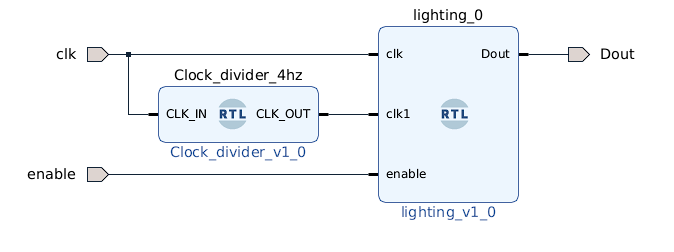

# WS2812b or Neopixel Driver [Issues Present]
## An implementation of NeoPxl driver 
Here I used seperate clock divider module to drive a counter process because it was causing Negative Time Slack while having it inside the top module.

Issues Deteccted on WS2812b Led drivers. while testing there seems to have some discrepancies with the lighting. They generally remain in the range of acceptable error, ie x value will only produce x color, the issue is in the brightness which seems to be messed up. These will be updated when i get back to it.

## Pin Layout
* Dout -> AR[0]
* enable -> SW0
* clk  -> H16 Pin from Eth PHY(125Mhz)

Demo is given Below.

Source is a writeup by [anfractuosity](https://www.anfractuosity.com/projects/lightdriver/)
